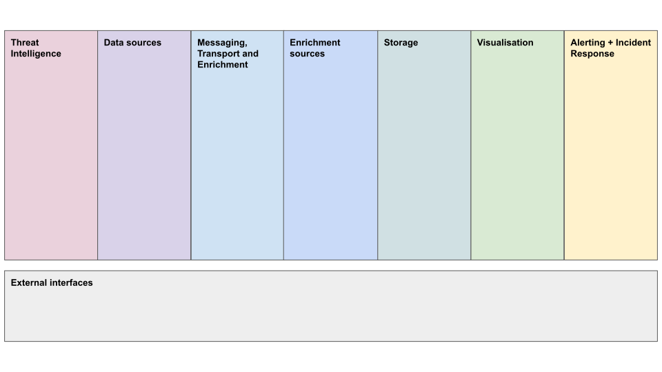

# SOC WG Reference Design Elements

For the purposes of this documentation we will refer to the SOC WG reference design, below; which details the various elements and concepts that contribute to a SOC deployment. In the following sections we will explore each element in turn.

## Threat intelligence

By what means is threat intelligence shared in two categories

- Human readable strategic
- Programmatic readable real-time

## Data sources
The purpose of the data sources feeding a security operations centre is to give visibility into the environment being monitored in sufficient detail to allow for the detection of anomalies and the investigation of security incidents. 

The choice of the highest priority data source will depend somewhat on the environment in question, but fine-grained network monitoring is an important first step in understanding an underlying network environment, particularly in a landscape with increasing use of dynamic computing resources such as cloud environments. 

Which security data sources are available to the SOC, includes
- network
- endpoint
- logging

## Messaging, Transport and Enrichment
Data pipelines refers to the software used to get raw data from your sources into your storage platform. This software typically takes data from some input, manipulates that data (normalizing it, enriching it, or both) and then sends it post-processing to an output. Most log data that a SOC collects will be from a wide variety of different sources and processing it through some common pipelines allows you to standardize your data and provide additional context. Many data pipeline tools have existing modules to process common log types, these should be used when possible to save on work. But you will no doubt run into cases where there’s no substitute for writing your own parsing logic.

## Enrichment sources

## Storage 
The processed data from the data sources, ingested and enriched via the data pipelines, must be stored on a platform that makes it available for visualisation and additional analysis and processing. 

Potential requirements when choosing a storage system
- Retention
- Hot/warm/cold access
- Replication and redundancy

How is the processed and enriched data stored. Can include

- rapid access (hot)
- medium access (warm)
- long term (cold)

## Visualisation

Dashboards 

## Alerting + Incident Response
Finally, collecting all this data will likely not provide value unless you can turn that data into something actionable. The alerting component of the software stack issues queries against the dataset looking for likely indicators of compromise, and then outputs those results to the security team through some communication method (ticket creation, email, instant messaging, etc.) Tuning your alerts to reduce false positives is a critical step in evolving your SOC, as too many unnecessary alerts will overload your team and cause them to not trust the system. Adding new alerts and removing ones that are not useful is a continuous process, there will be no point where this is “done” and alerts never need to be changed. 

- How are alerts raised based on the processed and enriched data, correlated with threat intelligence
- How is this made available to responders, and further integrated into new or existing incident management systems

## External interfaces
A vital aspect of cybersecurity across the modern research and education environment is sharing intelligence, best practices and procedures. Hence, interoperability between SOC environments is essential to allow for the most effective collaboration between sites and organisations.
