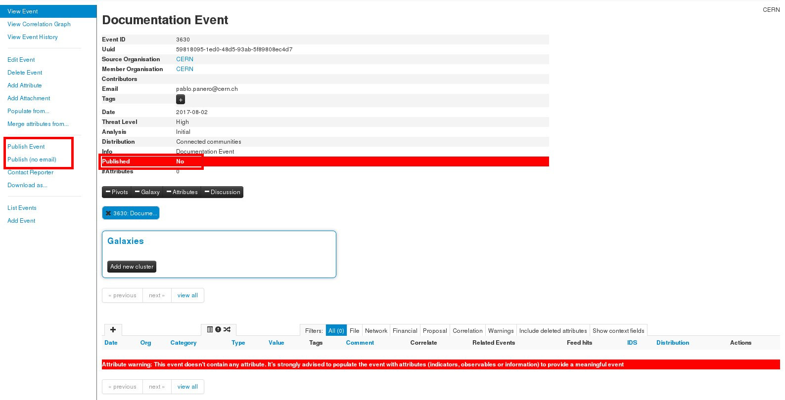

# Sharing in MISP
In order to share threat intelligence MISP offers the "event" abstraction which is made of 0 or more attributes. These ones can be IPs, domain names, file hashes, etc. (for more information on this see the [MISP book](https://github.com/MISP/misp-book)).

Things to take into account when sharing:

## Event creation and publishing
Once you create an event, it will not be shared until it is published. Once you click publish it will be **automatically shared**. However, it will not bypass the push rules.

## Push and pull rules.
In order to avoid sharing intelligence with the wrong organisation MISP allows us to set rules based on tags and organisations. This means that we can set which tags and / or organisations are allowed or blocked for sharing with a certain instance.

Take into account that these filters are an OR between the same category (tag or organisation) when allowed, an AND NOT when blocked and an AND between.

For example:

    ((tag1 OR tag2) AND !tag3 AND !tag4) AND ((org1 OR org2) AND !org3)

## Proposals

Proposals are only shared upon **push** (not publishing) and they **will bypass** the push rules. Meaning that if another instance already has the event for which a proposal is made that instance will get the proposal even if the event should not be pushed because of the push rules.

An example use case would be:

1. Instance A generates event A (with tag *tlp:amber*)
2. Instance B pulls from Instance A [Instance B has push rules *block tlp:amber* for Instance A]
3. Instance B generates a proposal for event A, publish and push
4. Instance A will get the proposal
